# Sistema de Inventario NawiTech

Proyecto base del sistema.

Integrantes

| Nombre | Carnet |
|----------|----------|
| Vladimir Ernesto Reyes | RZ23001 |
| Danilo Enrique Cabrera Rosales | CR20067 |
| Alirio Josue Sibrian Martinez | SM22043 |
| Diana Judith Ventura Erazo | VE24006 |
| Ronny Xavier Duran Delgado | DD23010 |


## Descripción del Proyecto

El Sistema de Inventario NawiTech es una aplicación web desarrollada para gestionar el inventario de una tienda de tecnología.

Permite administrar productos mediante operaciones CRUD (Crear, Leer, Actualizar y Eliminar), controlar existencias, visualizar reportes y consultar estadísticas del inventario.

### Funcionalidades principales

- Registro de productos.
- Edición de productos.
- Eliminación de productos.
- Búsqueda por nombre.
- Filtrado por categoría.
- Dashboard con estadísticas.
- Reportes de productos con bajo stock.
- Gráficos estadísticos por categorías.
- Modo claro y modo oscuro.
- API REST documentada con Swagger.

## Tecnologías Utilizadas

### Frontend
- React JS
- React Router
- Axios
- Recharts
- CSS3

### Backend
- Spring Boot
- Spring Data JPA
- Swagger OpenAPI

### Base de Datos
- PostgreSQL

### Contenedores
- Docker
- Docker Compose


## Arquitectura del Sistema

El sistema sigue una arquitectura cliente-servidor:

Frontend (React)
->
API REST (Spring Boot)
->
PostgreSQL (Base de Datos)

El frontend en React se comunica con el backend en Spring Boot a través de una API REST, y este backend gestiona la persistencia de datos en PostgreSQL.

## Diagrama Entidad-Relación

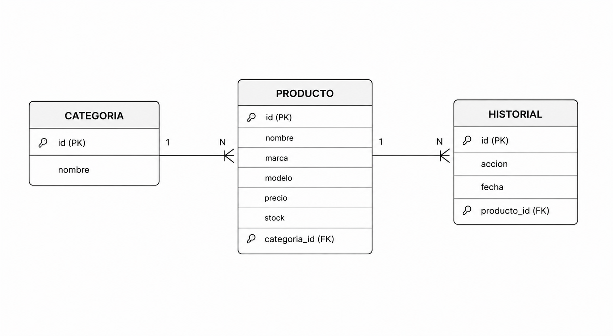

## Manual de Despliegue


### Requisitos

- Docker instalado
- Docker Compose instalado

### Pasos

1. Clonar el repositorio

```bash
git clone https://github.com/dianaventura415/inventario-de-una-tienda-de-tecnolog-a-.git
```

2. Ingresar al proyecto

```bash
cd inventario-de-una-tienda-de-tecnolog-a-
```

3. Ejecutar Docker Compose

```bash
docker-compose up --build -d
```

4. Esperar la creación de los contenedores.

5. Acceder al sistema:
```

Frontend:

http://localhost:5173

Backend:

http://localhost:8080

Swagger:

http://localhost:8080/swagger-ui.html

```

## Documentación de la API

### Swagger UI

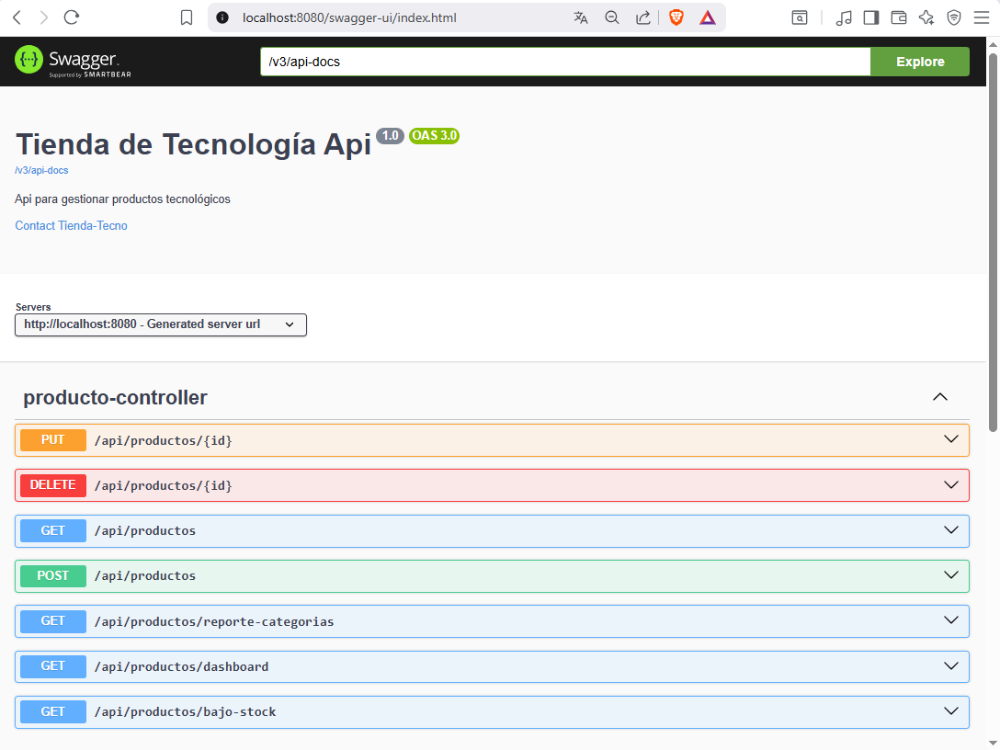

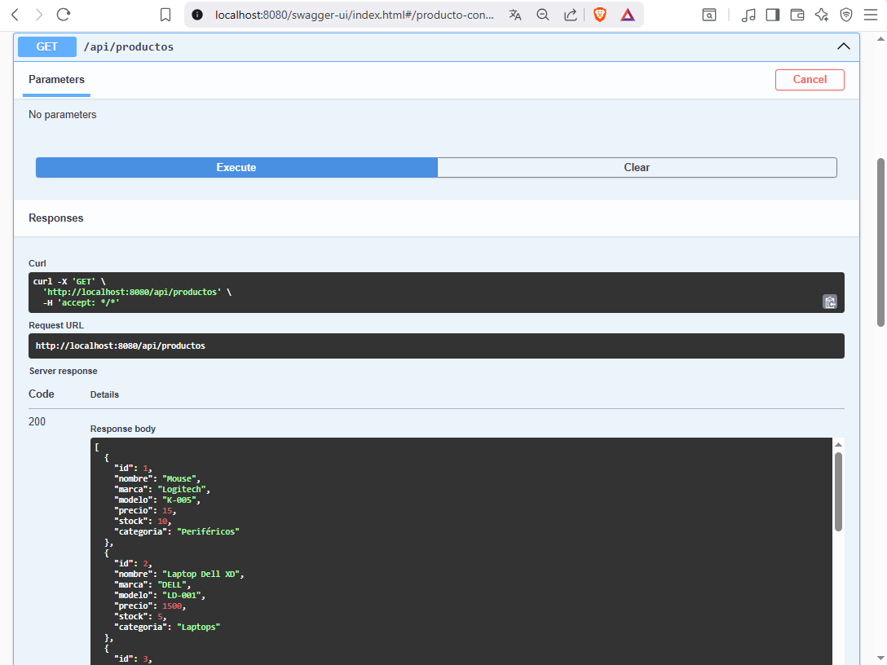

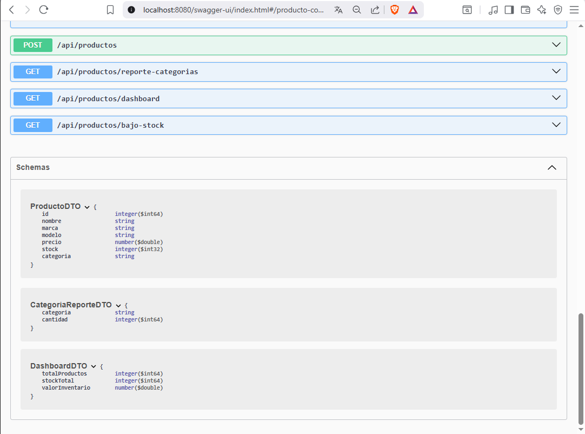

## Endpoints del Backend

| Método | Endpoint | Descripción |
|----------|----------|----------|
| GET | /api/productos | Obtener productos |
| POST | /api/productos | Crear producto |
| PUT | /api/productos/{id} | Actualizar producto |
| DELETE | /api/productos/{id} | Eliminar producto |
| GET | /api/productos/dashboard | Estadísticas |
| GET | /api/productos/bajo-stock | Productos con bajo stock |
| GET | /api/productos/reporte-categorias | Productos por categoría |

## Evidencias de Funcionamiento

### Dashboard

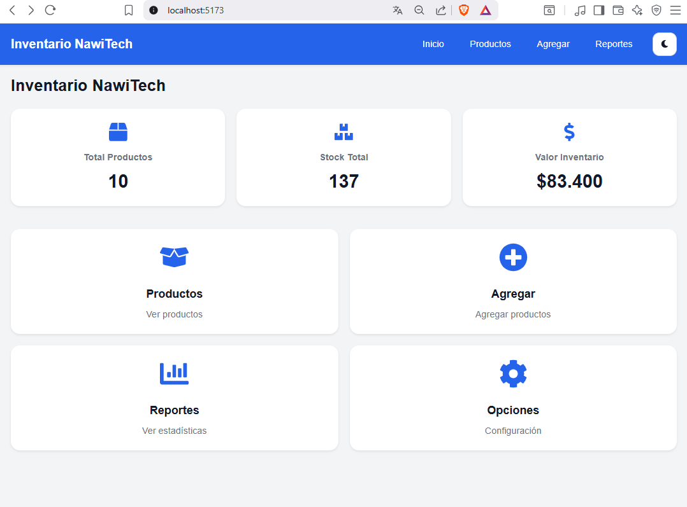

### Gestión de Productos

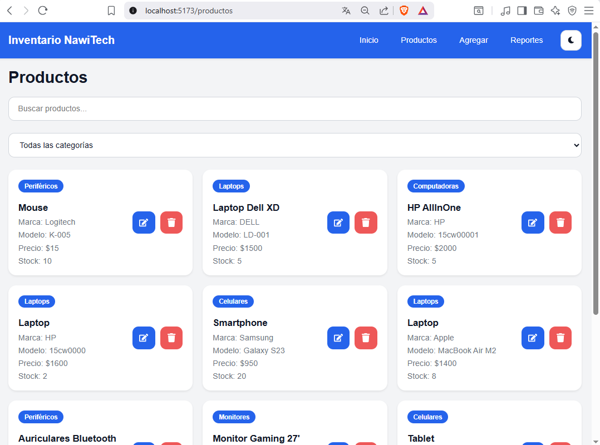

### Agregar Producto

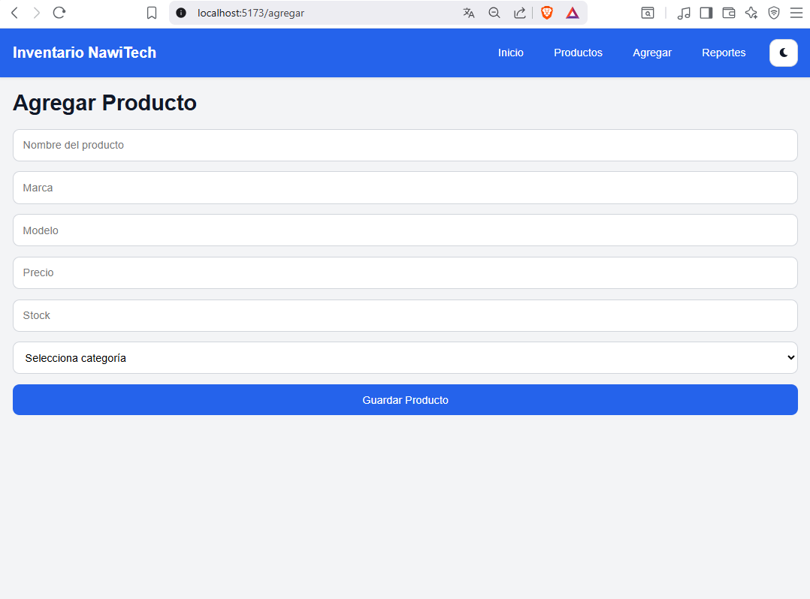

### Editar Producto

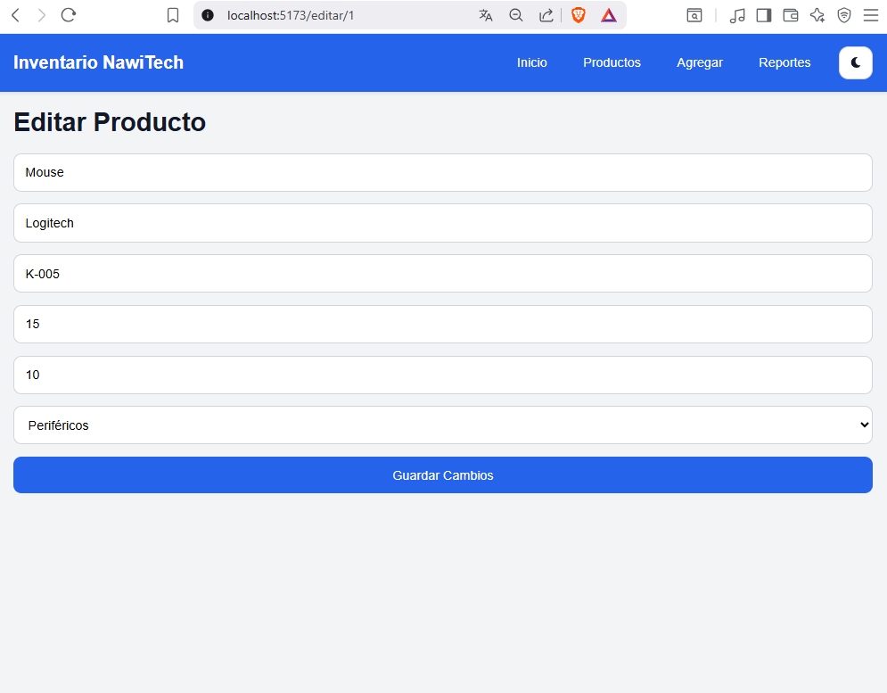

### Eliminar Producto

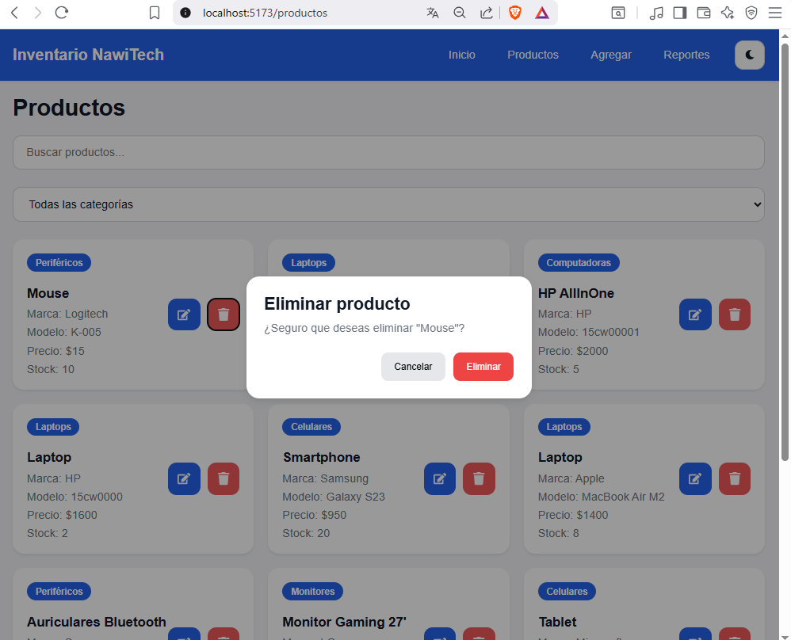

### Reportes

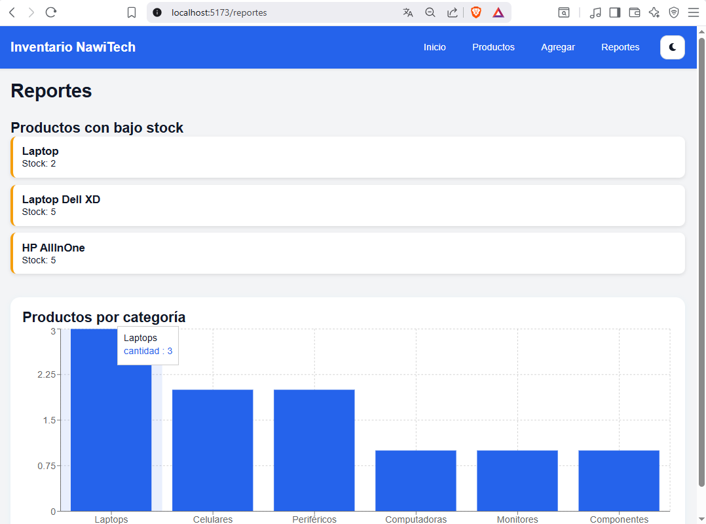

### Dashboard Version Móvil

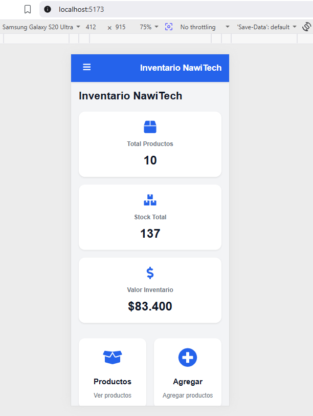

### Productos Version Móvil

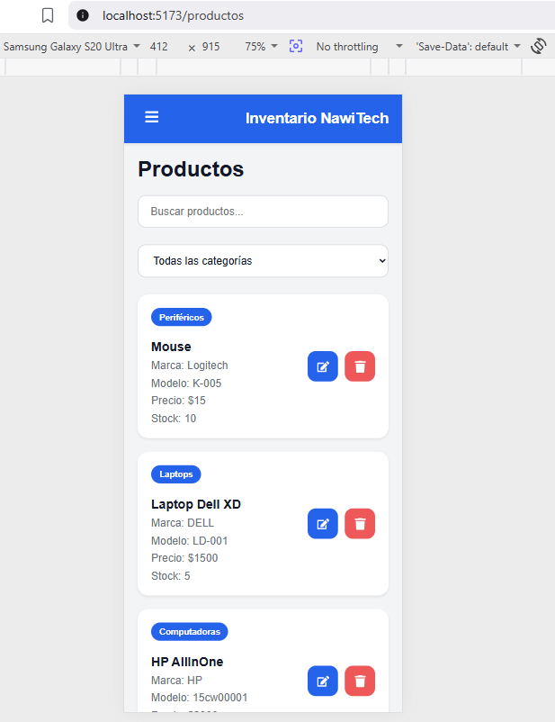

### Agregar Producto Version Móvil

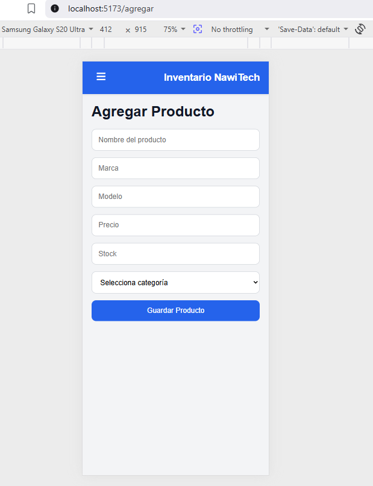

### Modo Oscuro

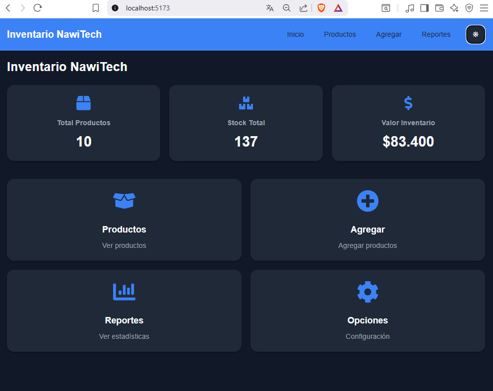